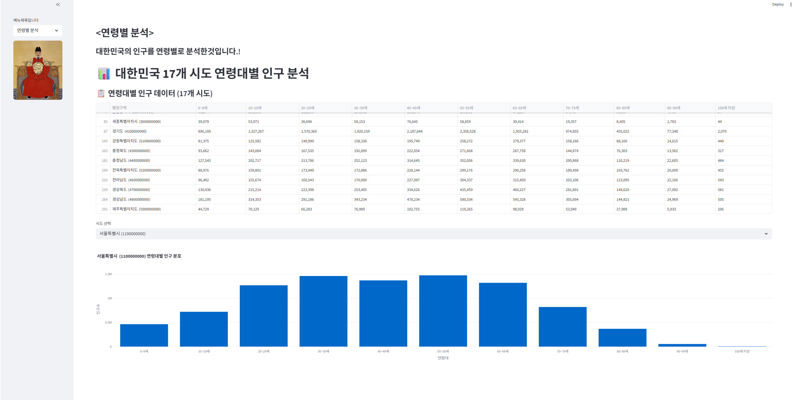
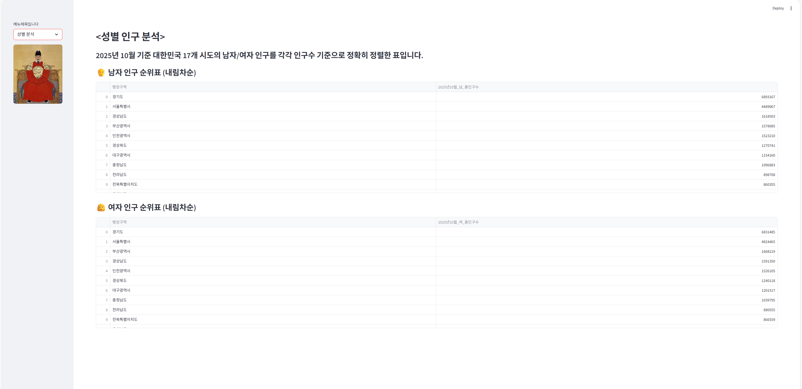
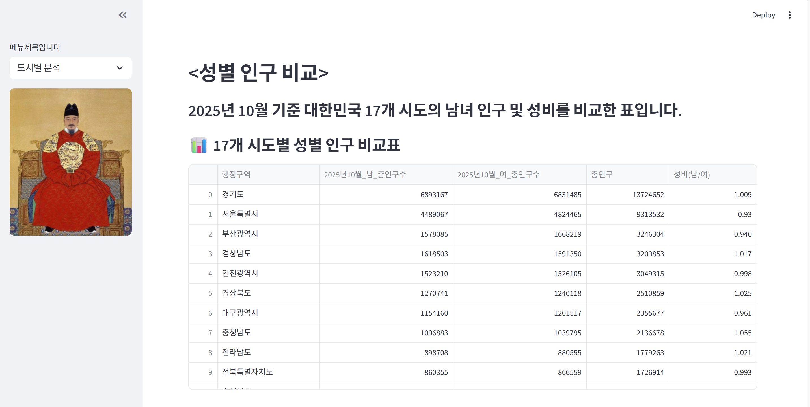
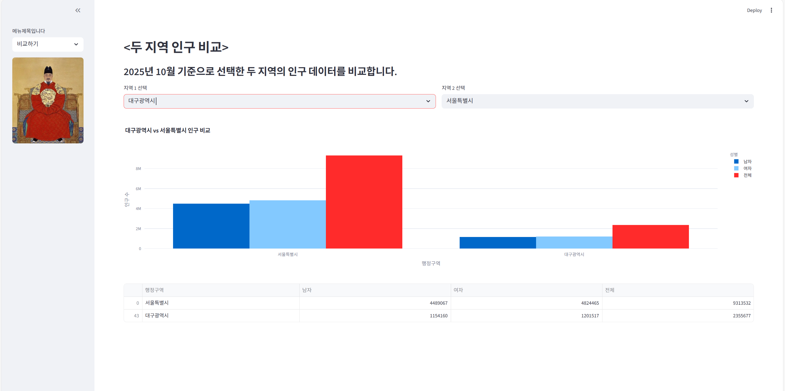
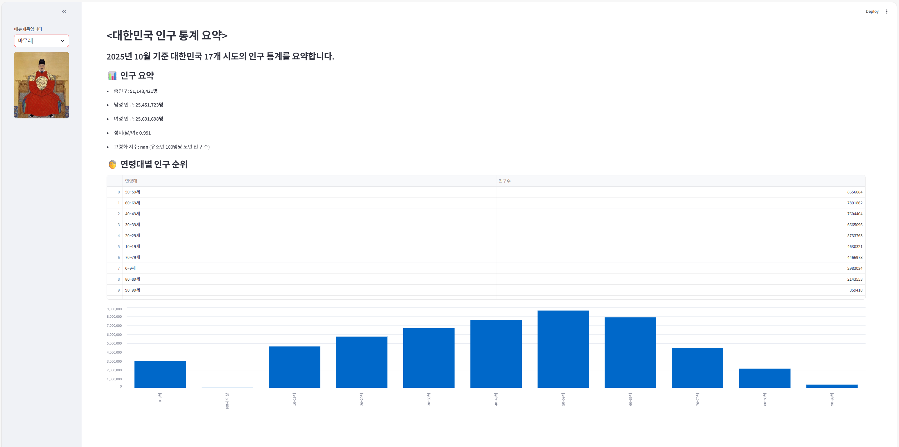

# 🇰🇷 대한민국 17개 시·도 인구 분석 대시보드

## 📌 프로젝트 개요
Streamlit을 활용하여 대한민국 17개 시·도의 인구 데이터를 분석하고 시각화한 대시보드입니다.  
연령별, 성별, 지역별 인구 구조를 직관적으로 파악할 수 있도록 구성했습니다.

---

## 🏠 HOME 화면


> 주요 도시별 인구현황을 시각화한 대시보드 메인 화면입니다.  
> 왼쪽 사이드바에서 연령별, 성별, 도시별 분석을 선택할 수 있습니다.

---

## 📊 연령대별 인구 분석



> 대한민국 17개 시·도의 인구를 연령대별로 분석한 결과입니다.  
> 표와 그래프를 통해 각 지역의 인구 구조를 직관적으로 파악할 수 있습니다.

---

## 👨‍👩‍👧‍👦 성별 인구 분석



> 2023년 11월 기준 대한민국 17개 시도에서 남자/여자 인구를 각각 정렬한 결과입니다.  
> 상위 10개 시군구를 기준으로 성별 인구 분포를 비교할 수 있습니다.

---

## 🏙️ 도시별 성비 비교



> 2025년 10월 기준 대한민국 17개 시도의 남녀 인구 및 성비를 비교한 표입니다.  
> 각 지역의 인구 규모와 성비 차이를 한눈에 확인할 수 있습니다.

---

## 🆚 두 지역 인구 비교



> 선택한 두 지역의 남자/여자/전체 인구를 비교한 시각화입니다.  
> 대도시와 지방의 인구 구조 차이를 직관적으로 확인할 수 있습니다.

---

## 📈 인구 통계 요약



> 전체 인구, 성비, 고령화 지수, 연령대별 인구 순위까지 요약한 대시보드입니다.  
> 대한민국 인구 구조의 핵심 지표를 한눈에 확인할 수 있습니다.

---

## 🎥 시연 영상
- [YouTube 링크](https://youtube.com/예시링크)

## 🌐 배포 링크
- [Streamlit Cloud](https://streamlit.io/예시링크)

## 👥 팀원 소개
- 홍석현  
- 조영재  
- 

---

## 💻 실행 방법
```bash
pip install -r requirements.txt
streamlit run project.py
